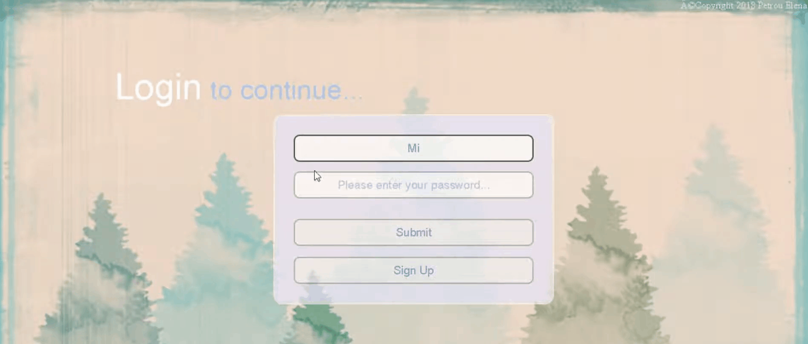

# Users login

The main idea of the project is that when the user is successfully logged in, the menu of the web app is modified, related to the category in which user belongs to. 
More specifically, some basic steps in order to create the project are the following:

* Database and table (users) creation. The table contains the fields *username, password and category* 
* Authentication of the user during the login

   * If user's authentication is **valid**: 
      * A **popup success message** is displaying on the screen 
      * The **user** is **logged in**
      * **Redirection to the welcome page** of the app
      * **Logout** feature and **redirection to the login page** of the app 
      
      *Note:* **The welcome page, the menu and generally the content of the app is modified**, related to the **category** in which **user belongs to**.
      In detail, some features are for example: *redirection to youtube songs or music sites if user belogs to music category, audio player on 
      welcome page if user belogs to photography category, tourism sites if user belogs to tourism category...*

   * If user's authentication is **invalid**: 
      * A **popup failure message** is displaying on the screen 
      * The user has **no permissions for login**
      * **Redirection to the login page** of the app

## Technologies

* MySQL database connection with jdbc.Driver
* Jsp File for user's authentication
* NetBeans IDE 8.2 for project creation

## Sneak preview

Here is a sneak preview and some **highlights** of the app:

* Invalid Authentication

* Valid Authentication

  
